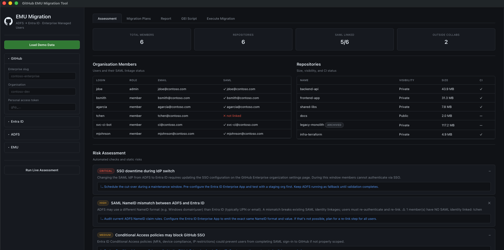
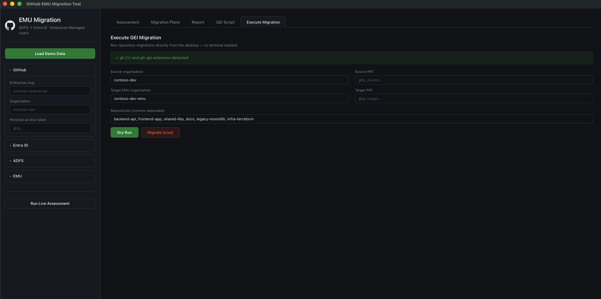

# gh-emu-migration

> **Proof of Concept** — not production-ready. Validate all migration plans in a non-production environment before applying changes.

CLI + desktop app for migrating a GitHub Enterprise organization from ADFS SAML SSO to Entra ID and Enterprise Managed Users (EMU).

## Quick Start

```bash
uv sync
uv run emu-migrate-desktop       # desktop GUI
uv run emu-migrate demo          # CLI demo (offline, no credentials)
```

For a real org:

```bash
cp config.example.yaml config.yaml
uv run emu-migrate assess
uv run emu-migrate plan
uv run emu-migrate report
uv run emu-migrate generate-gei-script
```

## Prerequisites

| Requirement | Details |
|---|---|
| Python | 3.10+ |
| uv | Package manager |
| GitHub PAT | Classic token with `admin:org`, `repo`, `read:user`, `user:email` |
| GitHub Enterprise Cloud | Required for SAML/SSO and EMU |
| Entra ID tenant | Global Admin or Application Admin role |
| GitHub CLI + GEI | `gh extension install github/gh-gei` |

## Configuration

Copy `config.example.yaml` → `config.yaml`:

```yaml
github:
  enterprise: "your-enterprise"
  organization: "your-org"
  token: "ghp_..."

adfs:
  federation_metadata_url: "https://adfs.example.com/.../FederationMetadata.xml"

entra_id:
  tenant_id: "00000000-0000-0000-0000-000000000000"
  client_id: "your-app-client-id"
  client_secret: ""

emu:
  short_code: "mycompany"
  target_organization: "your-org-emu"      # optional, defaults to {org}-emu
  owners_group: "GitHub-Org-Owners"
  members_group: "GitHub-Org-Members"

migration:
  dry_run: true
```

Environment variable overrides (tokens are never accepted as CLI arguments):

```bash
export GH_TOKEN="ghp_..."              # overrides github.token in config
export GH_SOURCE_PAT="ghp_..."         # source org PAT (migrate/GEI commands)
export GH_TARGET_PAT="ghp_..."         # target EMU org PAT (migrate/GEI commands)
export ENTRA_TENANT_ID="..."
export ENTRA_CLIENT_SECRET="..."
```

## Desktop App

Native GUI via [pywebview](https://pywebview.flowrl.com/) — WebKit on macOS, Edge WebView2 on Windows.





| Tab | Description |
|---|---|
| Assessment | Risk assessment with severity badges and automated checks |
| Migration Plans | SSO switch (10 steps) and EMU migration (14 steps) |
| Report | Markdown report with copy/download |
| GEI Script | Generated `gh gei migrate-repo` script with copy/download |
| Execute Migration | Run GEI migration directly (dry-run / live) |

```bash
uv run emu-migrate-desktop           # launch
uv run emu-migrate-desktop --debug   # launch with dev tools
```

### Building Standalone Binaries

#### macOS (.app)

```bash
uv pip install "pyinstaller>=6.0"
./packaging/build.sh               # → dist/EMU Migration.app
./packaging/build.sh --clean       # clean build
```

Distribute: zip the `.app` or create a DMG.

#### Windows (.exe)

```powershell
uv pip install "pyinstaller>=6.0"
pyinstaller packaging/emu_migration.spec --distpath dist/ --workpath build/ --noconfirm
# → dist\EMU Migration\EMU Migration.exe
```

Distribute: zip the `dist\EMU Migration\` folder or wrap with Inno Setup / NSIS.

> The spec sets `console=False` — no terminal window. On Windows, pywebview uses Edge WebView2 automatically.

## CLI Commands

| Command | Description |
|---|---|
| `emu-migrate demo` | Offline demo with synthetic data |
| `emu-migrate assess` | Inventory members/repos, evaluate 13 risks |
| `emu-migrate plan [--phase sso\|emu]` | Migration plan (SSO, EMU, or both) |
| `emu-migrate report` | Markdown report → `reports/migration-report.md` |
| `emu-migrate generate-gei-script` | GEI migration script |
| `emu-migrate gei-check` | Verify `gh` CLI + `gh-gei` extension |
| `emu-migrate migrate --dry-run\|--live` | Execute GEI migration |
| `emu-migrate reclaim-mannequins` | Mannequin mapping CSV / reclaim identities |
| `emu-migrate setup-test-org` | Provision test org with sample data |
| `emu-migrate live-test` | E2E test suite (7 checks) |
| `emu-migrate check-entra` | Verify Entra ID / Azure CLI readiness |
| `emu-migrate setup-entra` | Create app registration + service principal |

All API commands accept `--config config.yaml`.

## Security

- **Env-var-only tokens.** PATs never accepted as CLI arguments.
- **Token redaction.** PAT values redacted from subprocess logs.
- **Config validation.** Required fields validated before API calls.
- **GraphQL error handling.** Error responses raise immediately.
- **Pagination limits.** Capped at 1 000 pages.
- **Shell-safe scripts.** `shlex.quote()` on all interpolated values.

## Risk Catalogue (13 risks)

| ID | Severity | Risk |
|---|---|---|
| SSO-001 | CRITICAL | SSO downtime during IdP switch |
| SSO-002 | HIGH | SAML NameID mismatch (ADFS vs Entra ID) |
| SSO-003 | MEDIUM | Conditional Access policy conflicts |
| SSO-004 | HIGH | Service account authentication breakage |
| EMU-001 | CRITICAL | Personal accounts cannot convert to EMU in-place |
| EMU-002 | CRITICAL | Contribution history tied to personal accounts |
| EMU-003 | HIGH | Outside collaborators not supported in EMU |
| EMU-004 | HIGH | Personal forks, stars, gists lost |
| EMU-005 | HIGH | Actions secrets/environments need reconfiguration |
| EMU-006 | MEDIUM | GitHub Packages registry migration |
| EMU-007 | MEDIUM | GitHub Apps / OAuth Apps need reconfiguration |
| VAL-001 | HIGH | PATs and SSH keys require SSO re-authorization |
| VAL-002 | MEDIUM | CI/CD pipeline authentication updates |

## Project Structure

```
src/emu_migration/
├── cli.py              # Click CLI (emu-migrate)
├── desktop.py          # pywebview launcher (emu-migrate-desktop)
├── desktop_api.py      # Python ↔ JS bridge
├── ui/                 # Frontend (HTML/CSS/JS)
├── config.py           # YAML config + env var overrides
├── models.py           # Dataclasses
├── github_client.py    # REST + GraphQL client
├── assessment.py       # 13 risks, automated checks
├── sso_migration.py    # SSO switch planner (10 steps)
├── emu_migration.py    # EMU planner (14 steps) + GEI script
├── gei.py              # GEI CLI wrapper
├── report.py           # Markdown + Rich output
├── demo.py             # Synthetic Contoso data
└── _console.py         # Shared Console singleton

packaging/                # PyInstaller spec + build script
tests/                    # 22 unit tests + E2E live tests
```

## Development

```bash
uv sync --extra dev
uv run ruff check src/ tests/
uv run pytest tests/ -v
```

## Constraints

- **EMU is one-way.** No rollback once repos are migrated.
- **Outside collaborators first.** EMU doesn't support them.
- **Mannequins.** Use `reclaim-mannequins` to remap contribution history.
- **Dry-run by default.** Review output before switching to `--live`.
- **500-repo batch limit** per CLI run.

## Further Reading

- [LIVE_TESTING_GUIDE.md](LIVE_TESTING_GUIDE.md) — testing against a real org
- [TESTING.md](TESTING.md) — test phases and troubleshooting
- [config.example.yaml](config.example.yaml) — annotated config template
